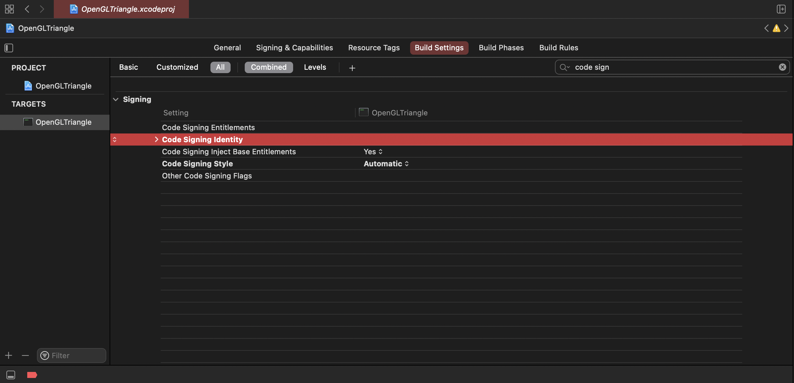
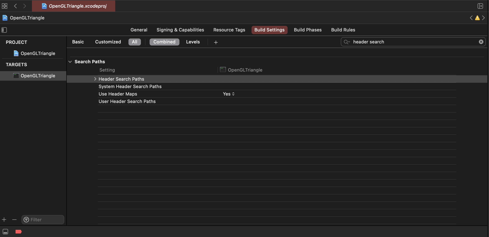
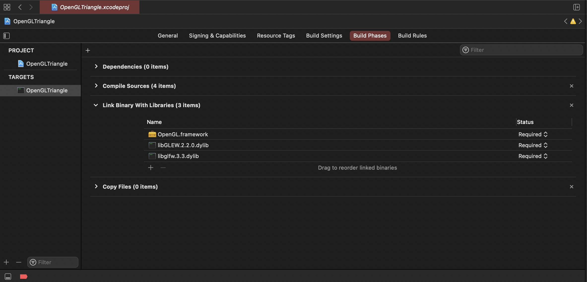
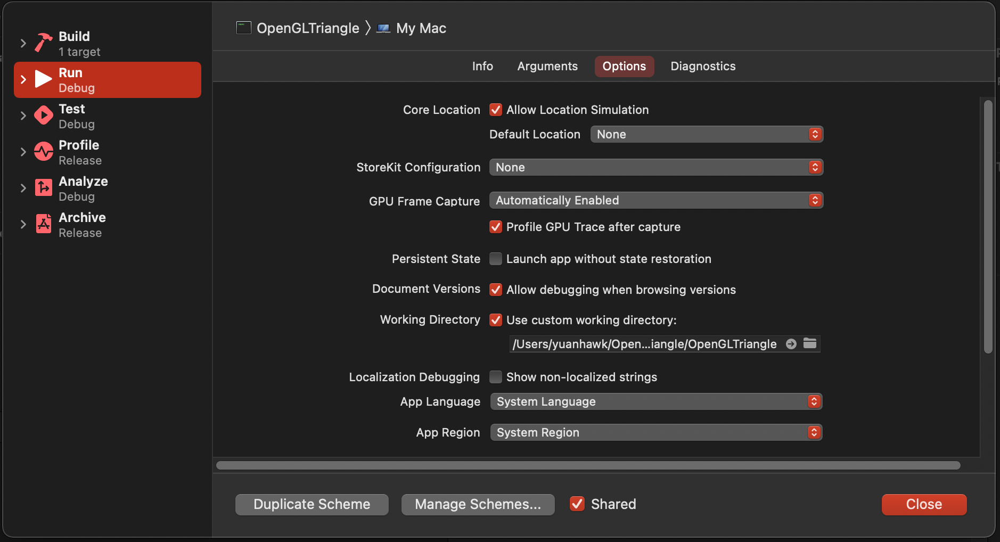

Content for OpenGL written in C++

# Setting up OpenGL on Xcode

## Go to Build Settings
Code signing identity -> clear it

Install GLFW & GLEW 
Go to Header Search Path -> 
add glfw include files 
/opt/homebrew/Cellar/glfw/<version>/include 
add glew include files 
/opt/homebrew/Cellar/glew/<version>/include 
OR 
Copy include files into project folder! (Recommended!)

### Go to Build Phases
Link Binaries With Libraries 
Select OpenGL.framework 
Add Files > Cmd+Shift+G > /opt/homebrew/Cellar 
/opt/homebrew/Cellar/glfw/<version>/lib/libglfw.<version>.dylib 
/opt/homebrew/Cellar/glew/<version>/lib/libGLEW.<version>.dylib 

### For setting up Shader files!
In short: It may be an issue with what your "working directory" is set to. There are two ways to remedy this.

1. Set the current working directory to the folder with your code (main.cpp, Mesh.cpp, etc). To do this, to Product -> Scheme -> Edit Scheme... then make sure you have Run selected on the left-hand side, and click Options at the top.

Under the Working Directory heading, make sure Use Custom Working Directory is ticked. Then for the directory itself, click the little folder symbol on the right-hand side of the text box and navigate to the folder that has all your code (main.cpp, Mesh.cpp, etc) and click "Choose".

This should cause your program to look in your project's code folder for the "Shaders" folder.

2. Alternatively, do everything in the first method, but untick the Use Custom Working Directory and instead move the Shaders folder into the Products folder. Without a custom working directory, it defaults to looking for files relative to the actual program that is being run, which is in the Products folder.
